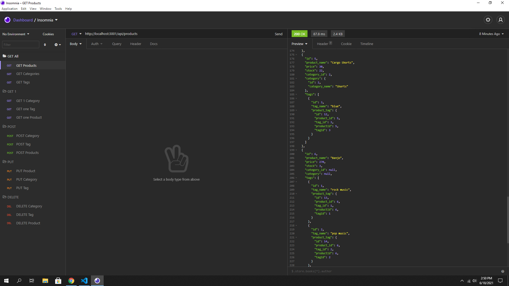
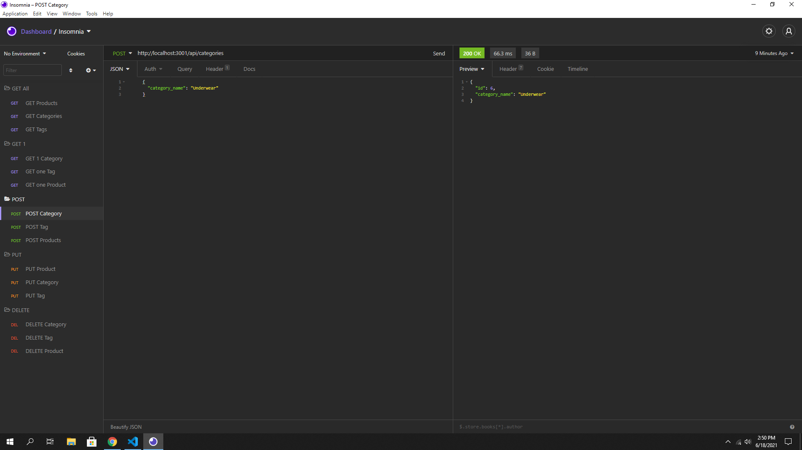

  <h1 align="center">CDUBS BACKEND ECOMMERCE APP</h1>
  
 
## Description
A back-end app to serve as a inventory database using SQL for the database
## Table of Contents
- [Description](#description)
- [Installation](#installation)
- [Usage](#usage)
- [License](#license)
- [Contributing](#contributing)
- [Tests](#tests)
- [Questions](#questions)
## Installation
💾 Install and run MySQL and run npm install in the CL. Seeded Data is provided, use npm run seed. You'll also need to set up a .env file with your database name, MySql username and password.
## Usage
💻 To serve as the for a backend ecommerce application.
## Demo
[Video Demo](https://drive.google.com/file/d/10xbV2_wNqcV5vv47qC1lYpfoCrjA2BYB/view?usp=sharing)

## Contributing
👪 Chris Winters
## Tests
✏️ Insomonia or Postman are great ways to test the api
## Questions
🙋‍♂️ Email or reach me on my GitHub  
 
:octocat: Find me on GitHub: [cwinters87](https://github.com/cwinters87) 
 
✉️ Email me with any questions: taylor314@gmail.com  
🌟This README was generated by Chris Winters using the [readme-generator](https://github.com/cwinters87/readme-generator)
